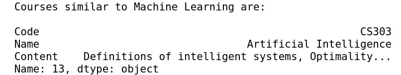

# Content-based-Recommendation-System
Recommending collage courses and jobs to students based on students' interests.

## Required Packages:
- python3
- sklearn
- Numpy
- pprint
- matplotlib
- SpaCy

## Screenshots

